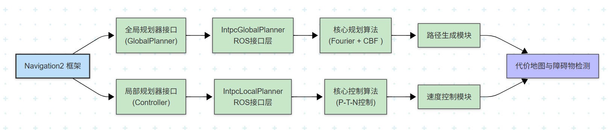

# Intpc_local_planner

## 一. 项目介绍

本项目是一个基于ROS2 Nav2框架的高性能导航解决方案，专为RoboMaster等机器人竞赛和工业场景设计。支持多种局部规划器（包括TEB和自主研发的IntPC规划器）的集成与切换，具备实时定位、建图和导航能力。

### 项目特点

- **多规划器支持**：内置TEB和IntPC两种局部规划器，支持用户自定义扩展
- **多传感器融合**：支持LiDAR（如Livox Mid360）的高精度定位与建图
- **实时性能优异**：支持100+Hz的里程计输出，确保导航实时性
- **仿真与实车兼容**：统一的接口设计，支持Gazebo仿真和真实环境部署
- **灵活配置**：丰富的参数配置，适应不同场景需求

## 二. 环境配置

### 支持环境
- **操作系统**：Ubuntu 22.04
- **ROS版本**：ROS2 Humble
- **仿真环境**：Gazebo Classic 11.10.0

### 安装步骤

1. **克隆仓库（包含子模块）**
    
    方法1：直接克隆时包含子模块（推荐）
    ```sh
    git clone --recursive https://github.com/Xiancaijiang/Intpc_local_planner.git
    cd Intpc_local_planner
    ```

    # 方法2：先克隆主仓库，然后初始化子模块
    ```sh
    git clone https://github.com/Xiancaijiang/Intpc_local_planner.git
    cd Intpc_local_planner
    git submodule update --init --recursive
    ```

2. **安装Livox SDK2**（用于LiDAR支持）
    ```sh
    sudo apt install cmake
    git clone https://github.com/Livox-SDK/Livox-SDK2.git
    cd Livox-SDK2 && mkdir build && cd build
    cmake .. && make -j && sudo make install
    ```

3. **安装项目依赖**
    ```sh
    rosdep install -r --from-paths src --ignore-src --rosdistro $ROS_DISTRO -y
    ```

4. **编译项目**
    ```sh
    colcon build --symlink-install
    ```

## 三. 运行

### 3.1 核心参数说明

| 参数名 | 可选值 | 说明 |
|--------|--------|------|
| `world` | `RMUL`/`RMUC`/自定义 | 仿真模式下选择场地，真实环境下为地图文件名 |
| `mode` | `mapping`/`nav` | `mapping`：边建图边导航<br>`nav`：已知地图导航 |
| `lio` | `fastlio`/`pointlio` | 激光里程计算法<br>`fastlio`：~10Hz，资源占用低<br>`pointlio`：~100Hz，定位更平滑 |
| `localization` | `slam_toolbox`/`amcl`/`icp` | 定位算法（仅`mode:=nav`有效） |
| `lio_rviz` | `True`/`False` | 是否可视化LiDAR点云 |
| `nav_rviz` | `True`/`False` | 是否可视化导航信息 |
| `planner_type` | `dwb`/`teb`/`intpc`/`intpc_global_dwb_local`/`<planner_config>` | 规划器配置选择<br>`dwb`：全局NavfnPlanner + 局部DWB<br>`teb`：全局NavfnPlanner + 局部TEB<br>`intpc`：全局NavfnPlanner + 局部Intpc<br>`intpc_global_dwb_local`：全局Intpc + 局部DWB（默认）<br>`<planner_config>`：自定义规划器配置 |

### 定位算法说明

- **slam_toolbox**：动态场景下定位效果好，支持回环检测
- **amcl**：经典概率定位算法，启动需手动给定初始位姿
- **icp**：基于点云配准的定位，仅初始定位时使用，长时间运行可能有累积误差

### 规划器配置说明

本项目支持四种规划器配置，每种配置使用不同的全局和局部规划器组合：

| 配置类型 | 全局规划器 | 局部规划器 | 特点 |
|---------|-----------|-----------|------|
| `dwb` | NavfnPlanner | DWB | 基于Dijkstra算法的全局规划 + 动态窗口法的局部规划 |
| `teb` | NavfnPlanner | TEB | 基于Dijkstra算法的全局规划 + 时间弹性带算法的局部规划，适合复杂环境动态避障 |
| `intpc` | NavfnPlanner | Intpc | 基于Dijkstra算法的全局规划 + 自主研发的集成规划与控制算法的局部规划 |
| `intpc_global_dwb_local` | Intpc | DWB | 默认配置，使用Intpc作为全局规划器（基于傅里叶路径表示和优化算法）+ DWB作为局部规划器 |

**全局规划器说明**：
- **NavfnPlanner**：Navigation2默认的全局规划器，基于Dijkstra算法，快速生成从起点到目标点的全局路径
- **Intpc全局规划器**：自主研发的全局规划器，使用傅里叶路径表示和优化算法，生成更平滑的全局路径

**局部规划器说明**：
- **DWB**：Navigation2默认的局部规划器，基于动态窗口法，在全局路径附近生成满足运动学约束的局部轨迹
- **TEB**：时间弹性带算法，通过优化时间参数化的路径来生成平滑的轨迹，适合复杂环境下的动态避障
- **Intpc**：自主研发的集成规划与控制算法，使用控制障碍函数（CBF）和二次规划优化，实现更精确的轨迹跟踪

### 3.2 仿真模式示例
    ```sh
    source install/setup.bash
    ```
#### 边建图边导航
```sh
ros2 launch rm_nav_bringup bringup_sim.launch.py \
world:=RMUL \
mode:=mapping \  
lio:=fastlio \
planner_type:=dwb \
lio_rviz:=False \
nav_rviz:=True
```

#### 已知地图导航
```sh
ros2 launch rm_nav_bringup bringup_sim.launch.py \
world:=RMUL \
mode:=nav \
lio:=fastlio \
localization:=slam_toolbox \
planner_type:=dwb \
lio_rviz:=False \
nav_rviz:=True
```

#### 使用Intpc全局规划器 + DWB局部规划器导航
```sh
ros2 launch rm_nav_bringup bringup_sim.launch.py \
world:=RMUL \
mode:=nav \
lio:=fastlio \
localization:=slam_toolbox \
planner_type:=intpc_global_dwb_local \
lio_rviz:=False \
nav_rviz:=True
```

### 3.3 真实环境示例

#### 边建图边导航
```sh
ros2 launch rm_nav_bringup bringup_real.launch.py \
world:=YOUR_WORLD_NAME \
mode:=mapping  \
lio:=fastlio \
planner_type:=dwb \
lio_rviz:=False \
nav_rviz:=True
```

**地图保存说明**：
1. **保存点云地图**：修改 `src/rm_nav_bringup/config/reality/fastlio_mid360_real.yaml` 中的 `pcd_save_en` 为 `true`，设置保存路径后运行：
   ```sh
   ros2 service call /map_save std_srvs/srv/Trigger
   ```
2. **保存栅格地图**：参考 [保存 .pgm 和 .posegraph 地图](https://gitee.com/SMBU-POLARBEAR/pb_rmsimulation/issues/I9427I)，地图名需与 `YOUR_WORLD_NAME` 一致。

#### 已知地图导航
```sh
ros2 launch rm_nav_bringup bringup_real.launch.py \
world:=YOUR_WORLD_NAME \
mode:=nav \
lio:=fastlio \
localization:=slam_toolbox \
planner_type:=dwb \
lio_rviz:=False \
nav_rviz:=True
```

### 3.4 辅助工具

#### 键盘控制
```sh
ros2 run teleop_twist_keyboard teleop_twist_keyboard
```

#### 地图保存脚本
```sh
# 保存点云地图
./save_pcd.sh

# 保存栅格地图
./save_grid_map.sh
```

## 四. 规划器配置与使用

本项目支持多种规划器配置，可根据场景需求选择合适的规划器组合。

### 4.1 规划器配置选项

| 配置类型 | 全局规划器 | 局部规划器 | 特点 |
|---------|-----------|-----------|------|
| `dwb` | NavfnPlanner | DWB | 配置简单，可靠性高 |
| `teb` | NavfnPlanner | TEB | 避障能力强，轨迹平滑 |
| `intpc` | NavfnPlanner | Intpc | 跟踪精度高，控制平稳 |
| `intpc_global_dwb_local` | Intpc | DWB | 全局路径平滑，局部反应迅速（默认） |

### 4.2 Intpc规划器架构

Intpc规划器采用模块化设计架构，同时支持全局和局部规划功能：



**模块说明**：
- **全局规划器**：使用傅里叶路径表示和CBF优化，生成平滑全局路径
- **局部规划器**：基于比例-切向-法向控制，实现高精度轨迹跟踪
- **代价地图集成**：从Nav2代价地图获取障碍物信息，支持实时避障

**详细实现**：算法原理、代码结构和配置参数请参考 **Intpc规划器实现文档** (`src/rm_navigation/Intpc_local_planner/README.md`)

### 4.3 Intpc规划器特性

Intpc规划器是本项目的核心规划器，同时提供全局和局部规划能力：

**核心特性**：
- **全局规划器**：使用傅里叶路径表示，生成平滑路径，集成CBF优化实现安全避障
- **局部规划器**：基于比例-切向-法向控制，实现高精度轨迹跟踪和动态避障

**详细文档**：
- 算法原理、代码结构和配置参数请参考 **Intpc规划器实现文档** (`src/rm_navigation/Intpc_local_planner/README.md`)
- 该文档包含完整的实现指南、性能调优和自定义规划器集成步骤

### 4.4 规划器选择建议

| 场景 | 推荐配置 | 优势 |
|------|----------|------|
| 简单环境 | `dwb` | 配置简单，启动迅速 |
| 动态环境 | `teb` | 避障能力强，适应性好 |
| 高精度要求 | `intpc` | 控制精度高，运动平稳 |
| 全局优化 | `intpc_global_dwb_local` | 路径平滑，综合性能优 |

## 五. 实车适配指南

### 1. 雷达配置
- **IP设置**：修改 `src/rm_nav_bringup/config/reality/MID360_config.json` 中的 `lidar_configs.ip`
- **点云旋转**：雷达倾斜放置时，在 `extrinsic_parameter` 中设置旋转角度

### 2. 坐标参数
- **雷达安装位置**：测量底盘中心到雷达的相对坐标（x, y 影响定位精度），填入 `src/rm_nav_bringup/config/reality/measurement_params_real.yaml`
- **雷达高度**：测量雷达与地面的垂直距离，填入 `src/rm_nav_bringup/config/reality/segmentation_real.yaml` 中的 `sensor_height`

### 3. 导航参数
关键参数包括：
- `robot_radius`：机器人碰撞半径
- 速度限制参数：`max_vel_x`、`max_vel_theta` 等
- 加速度限制参数：`acc_lim_x`、`acc_lim_theta` 等

详见 [Nav2官方文档](https://docs.nav2.org/) 了解更多参数配置。

## 六. 项目结构

```
├── src/
│   ├── rm_driver/         # 传感器驱动（Livox雷达等）
│   ├── rm_localization/   # 定位算法（FAST_LIO、Point_LIO、ICP等）
│   ├── rm_nav_bringup/    # 启动文件和配置
│   ├── rm_navigation/     # 导航核心功能
│   │   ├── Intpc_local_planner/   # 自主研发的IntPC局部规划器
│   │   ├── costmap_converter/     # 代价图转换工具
│   │   ├── fake_vel_transform/    # 速度转换工具
│   │   ├── rm_navigation/         # Nav2配置和启动文件
│   │   └── teb_local_planner/     # TEB局部规划器
│   ├── rm_perception/     # 感知模块（地面分割等）
│   └── rm_simulation/     # 仿真相关功能
├── build.sh               # 一键编译脚本
├── save_grid_map.sh       # 栅格地图保存脚本
├── save_pcd.sh            # 点云地图保存脚本
├── README.md              # 项目说明文档
└── LICENSE                # 许可证
```

## 七. 自检机制

### 7.1 规划器自检

**详细的自检机制**：请参考 **Intpc规划器实现文档** (`src/rm_navigation/Intpc_local_planner/README.md`) 中的自检章节，包含：
- 插件注册验证
- 接口实现检查
- 配置文件验证
- 编译和运行时测试
- 常见问题排查

**快速验证**：
```bash
# 检查插件注册
cat src/rm_navigation/Intpc_local_planner/intpc_local_planner_plugin.xml

# 编译验证
colcon build --packages-select Intpc_local_planner --symlink-install

# 运行验证
ros2 launch rm_nav_bringup bringup_sim.launch.py planner_type:=intpc_global_dwb_local
```

## 八. 致谢与参考

### 算法参考
- IntPC算法思想来源于北航机器人平台相关工作
- LiDAR点云仿真参考：`livox_laser_simulation`、`livox_laser_simulation_RO2`

### 代码基础
- 基于[深圳北理莫斯科大学 北极熊战队 导航系统](https://github.com/LihanChen2004/PB_RMSimulation.git)、[中南大学 FYT 战队 RM 哨兵上位机算法](https://github.com/baiyeweiguang/CSU-RM-Sentry) 开发

### 开源依赖
- [Navigation2](https://navigation.ros.org/)
- [FAST_LIO](https://github.com/hku-mars/FAST_LIO)
- [Point-LIO](https://github.com/hku-mars/Point-LIO)
- [TEB Local Planner](http://wiki.ros.org/teb_local_planner)

感谢所有为开源导航社区做出贡献的开发者们！